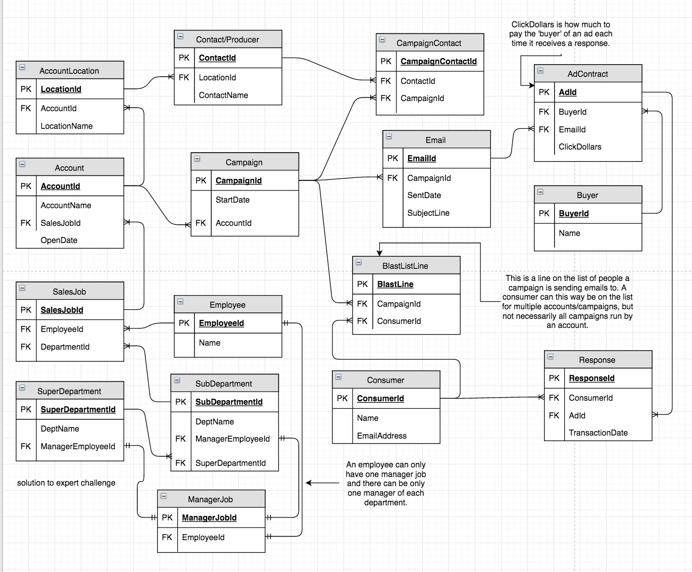

# Email Marketing ERD Challenge Exercise 

### Author: Megan Ford August 2016

Exercise completed as part of Nashville Software School's Back-end (Python) bootcamp, Milestone 3- Database Driven Applications. A demonstration of skills learned at time of creation. See below for instructions followed. 

# Exercise Instructions

[Original Readme](https://github.com/nashville-software-school/python-milestones/blob/master/03-database-driven-applications/exercises/DBS_ERD_CHALLENGE.md)

## ERD Authoring Challenge

If you feel that you have a good foundation for how to model concepts for a database, use [draw.io](https://www.draw.io) to map out the relationships for the following application.

### Email Marketing

You are charged with building out the entire database structure for an email marketing company that sells a service for any customer to send marketing emails out, keep track of each campaign, and determine the effectiveness of each one.

### Consumers

These are the people who will receive the marketing email. The system must track their name, email address, and the customer who is targeting them for marketing.

### Customers

These are the customers of your service. The system must track the person who is the point of contact, their company name, and the sales rep who acquired them as a customer.

1. There may be more than one point of contact for a customer.
2. There may be more than one physical location for each customer.
3. The point of contact can be at any of those physical locations.

### Buyers

A buyer is an third-party company that one of your customers sells ad space to. These buyer will pay your customer money in order for them to include their product in one of their marketing emails.

1. Each time a consumer interacts with a buyer's ad in an email, they will get paid a contracted amount of money.
1. The amount a buyer is paid can vary depending on the campaign.
1. A buyer can be in more that one campaign.

### Departments

These are the departments within your company, to which an employee can be assigned. Each department has a name, and a single employee who is the manager of that department.

### Sales Rep

These are your employees who are charged with acquiring customers. Each time a customer creates an account on your platform, the sales rep who facilitated the sale must be recorded .

1. A sales rep can be in more than one department.

### Campaigns

These are the marketing campaigns that your customers create in your system to sell their own products.

1. Each campaign is named.
1. Multiple campaigns can be targeted to each one of your customer's consumers.
1. Each campaign can have multiple producers (i.e. multiple people at a customer's company who are responsible for managing it).
1. A campaign can have several emails that are produced.

### Emails

These are the individual emails that can be sent to consumer as part of a long-running campaign.

1. Each email will have a name within the campaign, and the date it was broadcast to consumers must be recorded.
1. There can be multiple buyers in a single campaign.

### Responses

Each time a consumers actually clicks on a hyperlink in a campaign's email, the system will record that action.

1. Track the campaign
1. Track the email
1. Track the consumer
1. Track the buyer
1. Date of transaction

## Expert Challenge

Departments can actually be within another department. For example, Sales is a department with a manager, but there is a specialized department for Inside Sales, and Outside Sales. Each of those departments have a manager that must report to the overall Sales manager.

# License 
[license](license.md)
